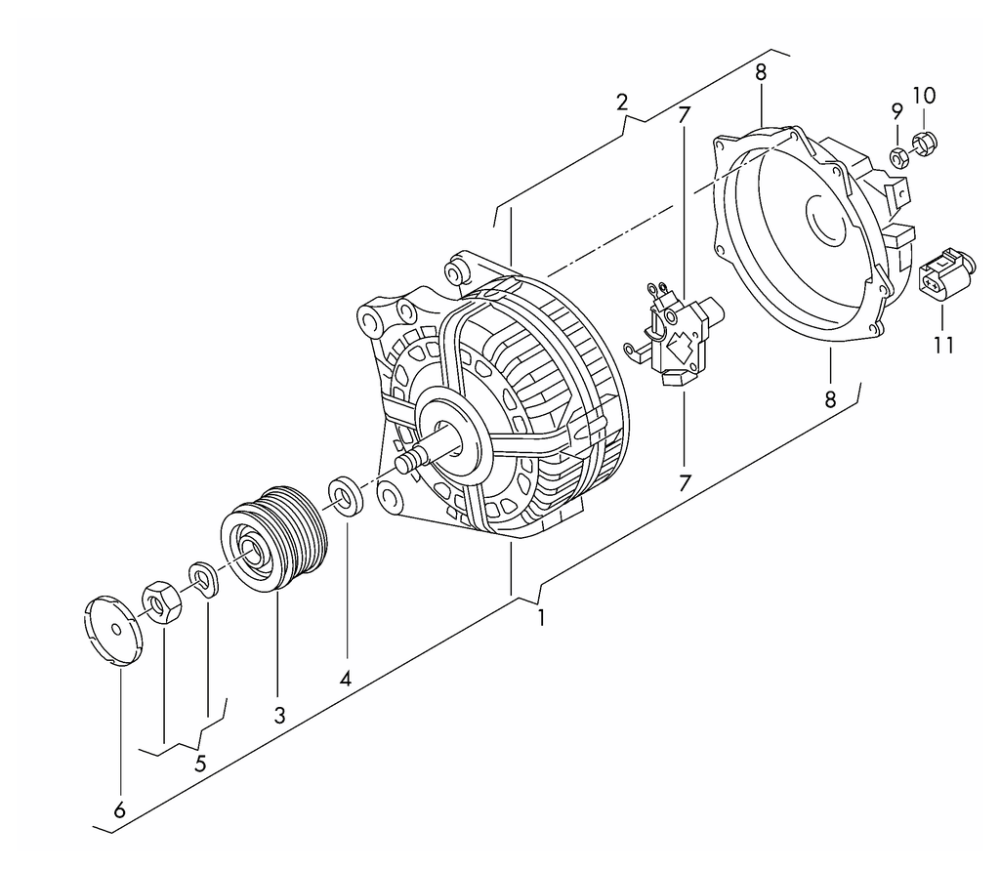
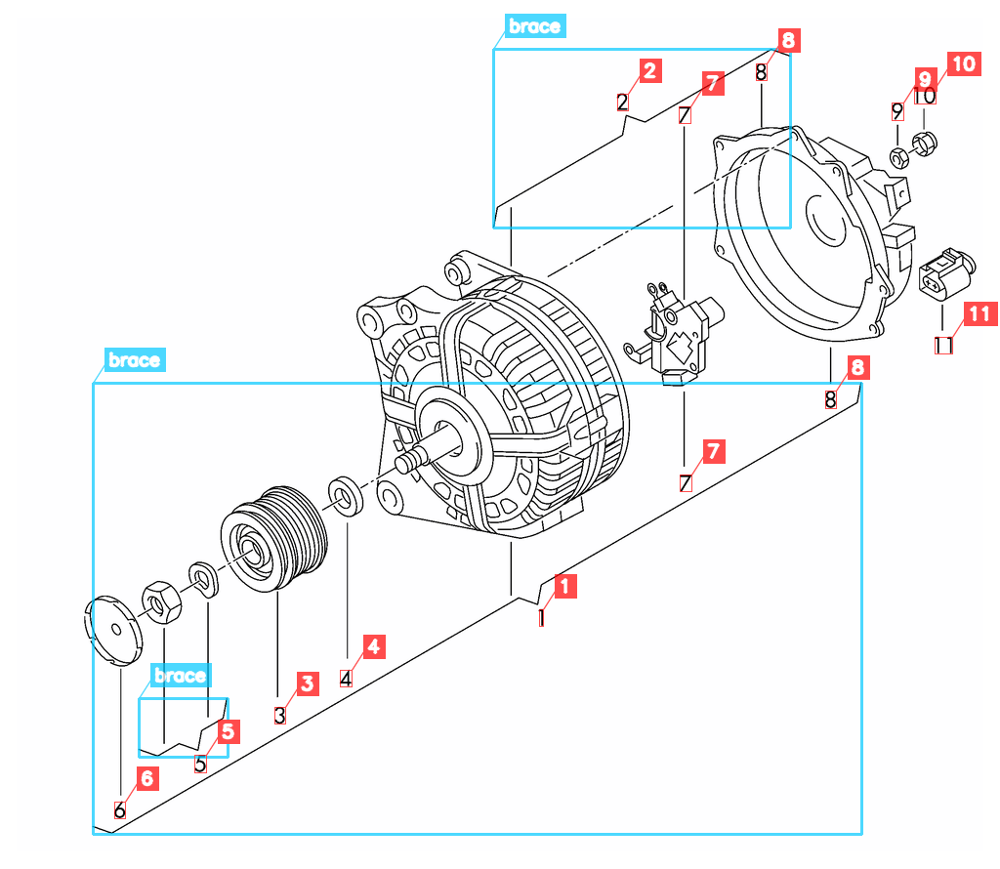

<div align="center">
<h1>parts-diagram-ocr</h1>
<p>Detect callout numbers and their grouping braces on exploded-view spare-parts diagrams.</p>
</div>

---

Exploded-view assembly diagrams from major spare-parts catalogs label each part
with a small **callout number** at the end of a leader line, and group related
parts with a `{` **brace**. This tool reads those callouts and reconstructs the
groupings.

Built for **raster** diagrams: black line art on white (PNG/GIF), the static
format such catalogs export. Vector (SVG) schematics are already clickable and
don't need OCR; this fills the gap for the raster ones.

| Input | Detected |
|:---:|:---:|
|  |  |

*Each detected callout number is pulled out as a red leader-linked label.
Grouping braces are highlighted: cyan for braces drawn as diagonal lines, and
magenta (with the group id) for braces bound to their member callouts. All marks
are semi-transparent so the underlying drawing stays readable.*

## How it works

Clean black-on-white line art defeats off-the-shelf OCR detectors (they look for
words, not isolated digits), so detection is done with classic CV and only the
*recognition* uses ML:

1. **Detect** glyph blobs with connected components, group adjacent ones into numbers.
   A fill + aspect-ratio filter keeps narrow `1`/`11` digits while rejecting
   leader-line fragments.
2. **Gate** by whitespace isolation: real callouts sit in the margin, drawing
   features sit in ink.
3. **Recognize** every candidate in one batched EasyOCR call (`0-9` + `A/B` suffix).
4. **Group** detected `{` braces (vertical and horizontal), binding each to its
   group-id + member callouts. Braces drawn as diagonal lines are also detected
   (as open polylines) and highlighted, though not yet auto-numbered.

See [`docs/adr/`](docs/adr) for the decisions behind this (engine choice, grouping).

## Setup

Requires Python 3.10+.

```bash
python -m venv .venv && source .venv/bin/activate
pip install -r requirements.txt   # opencv, numpy, Pillow, easyocr (pulls torch, CPU)
```

## Usage

```bash
# all images in data/images/
python -m src.detect

# specific files
python -m src.detect data/images/258103600.png

# JSON only, no overlay images
python -m src.detect --no-overlay
```

Outputs land in `data/out/`:
- `<name>.json`: detections, groups, and `open_braces` (diagonal brace boxes)
- `<name>_overlay.png`: annotated image

```json
{
  "image": "258103600.png",
  "detections": [{"text": "17", "conf": 1.0, "bbox": [135, 340, 179, 374]}],
  "groups": [{"group": "15", "members": [{"text": "17", "bbox": [...]}],
              "brace_bbox": [...], "group_bbox": [...]}],
  "open_braces": [[505, 50, 304, 183]]
}
```

Throughput ≈ 1 s/image after a one-time ~30 s model load.

## Tests

```bash
pip install pytest && python -m pytest tests -q
```

## Limitations

- Interior drawing features occasionally misread as a digit.
- Nested braces double-count: a sub-group's members also list under the outer group.
- Only `A`/`B` callout suffixes; the letter is sometimes lost when faint (`4A` → `4`).
- Diagonal grouping braces are detected and highlighted but not yet auto-numbered
  (the prong that points at the group id is too noisy to read reliably).

The original 2018 Python 2.7 template-matching + KNN prototype is kept under
[`legacy/`](legacy) for reference.

## License

MIT. See [LICENSE](LICENSE).
