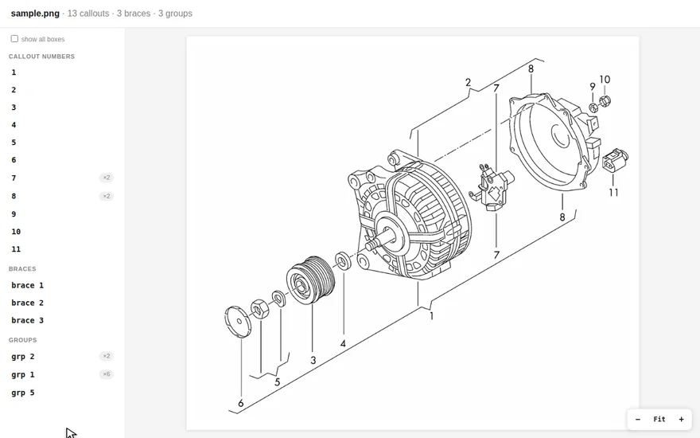

<div align="center">
<h1>parts-diagram-ocr</h1>
<p>Detect callout numbers and their grouping braces on exploded-view spare-parts diagrams.</p>

<a href="https://tegos.github.io/parts-diagram-ocr/sample.html">
  
</a>

<sub><b><a href="https://tegos.github.io/parts-diagram-ocr/sample.html">▶ Open the live interactive viewer</a></b> — fit · wheel-zoom · drag-pan · click a number to fly to its part · hover a group to light its members</sub>
<br>
<sub>more live pages: <a href="https://tegos.github.io/parts-diagram-ocr/710501100.html">710501100</a> · <a href="https://tegos.github.io/parts-diagram-ocr/121105250.html">121105250</a> · <a href="https://tegos.github.io/parts-diagram-ocr/689615500.html">689615500</a></sub>
</div>

---

Exploded-view assembly diagrams from major spare-parts catalogs label each part
with a small **callout number** at the end of a leader line, and group related
parts with a `{` **brace**. This tool reads those callouts and reconstructs the
groupings.

Built for **raster** diagrams: black line art on white (PNG/GIF), the static
format such catalogs export. Vector (SVG) schematics are already clickable and
don't need OCR; this fills the gap for the raster ones.

| Input | Detected |
|:---:|:---:|
|  |  |

*Each detected callout number is pulled out as a red leader-linked label.
Grouping braces bound to a group id — axis-aligned `{` braces and diagonal
bracket lines alike — are highlighted in magenta with the id. All marks are
semi-transparent so the underlying drawing stays readable. (Detected braces
that can't be bound to an id stay off the static overlay — kept in the JSON
and shown on demand in the interactive viewer, see `docs/adr/0002`.)*

## Quickstart

Requires Python 3.10+.

```bash
python -m venv .venv && source .venv/bin/activate
pip install -r requirements.txt   # opencv, numpy, Pillow, easyocr (pulls torch, CPU)

python -m src.detect                            # all images in data/images/
python -m src.detect data/images/258103600.png  # specific files
python -m src.detect --no-overlay               # JSON only
python -m src.detect --profile                  # + per-stage timing table
```

Outputs land in `data/out/`: `<name>.json` with the detections and
`<name>_overlay.png` with the annotated image.

## Output JSON

```json
{
  "image": "258103600.png",
  "detections": [{"text": "17", "conf": 1.0, "bbox": [138, 342, 176, 371]}],
  "groups": [{"group": "15", "members": [{"text": "17", "bbox": [138, 342, 176, 371]}],
              "brace_bbox": [94, 317, 151, 880], "group_bbox": [52, 579, 89, 608]}],
  "open_braces": [[505, 50, 304, 183]]
}
```

- `detections` — every callout read off the drawing: the text (digits plus an
  optional letter suffix like `4A`), the recognizer confidence, and the pixel
  bbox as `[x0, y0, x1, y1]`.
- `groups` — one entry per brace that was bound to a group id: the id text and
  its bbox, the brace's own bbox, and the member callouts the brace embraces.
  Nested braces each get their own entry, so a member can appear in two groups
  when the drawing nests them.
- `open_braces` — diagonal brace candidates as `[x, y, w, h]` boxes that were
  detected but not bound to an id. The static overlay skips them; the
  interactive viewer shows them on demand.

## Benchmarks

Scored against hand-labeled ground truth for 20 of the 100 dataset images
(`eval/groundtruth/`, run `python -m eval.score`):

| metric | precision | recall | F1 |
|---|---|---|---|
| callout numbers (set-based) | 99% | 98% | 98% |
| groups, by id | 83% | 69% | 75% |

Callout scoring is set-based per image — did we read the right numbers — so
duplicate reads of one number don't inflate precision; they are reported
separately. Group scoring counts a detected group as a hit when its id matches
a drawn brace's id; member-set precision/recall per matched group is printed
alongside.

Throughput: **1.0 s/image** across the full 100-image batch, 2.1 s/image on
the (larger-than-average) 20 ground-truth images — CPU, WSL2, including a
one-time ~25 s EasyOCR model load. `--profile` attributes ~93% of the time to
recognizer inference; everything else (decode, binarize, brace geometry,
writes) is noise.

## How it works

Clean black-on-white line art defeats off-the-shelf OCR detectors (they look for
words, not isolated digits), so detection is done with classic CV and only the
*recognition* uses ML:

1. **Detect** glyph blobs with connected components, group adjacent ones into numbers.
   A fill + aspect-ratio filter keeps narrow `1`/`11` digits while rejecting
   leader-line fragments.
2. **Gate** by whitespace isolation: real callouts sit in the margin, drawing
   features sit in ink.
3. **Recognize** every candidate in one batched EasyOCR call (`0-9` + `A/B` suffix).
   Low-confidence reads retry glyph-by-glyph, recognition only — the crop is
   already the glyph, so no detector pass is needed.
4. **Group** detected braces, binding each to its group-id + member callouts.
   Axis-aligned `{` braces associate by row/column adjacency; braces drawn as
   diagonal lines (open polylines) associate by prong geometry — the id sits
   within ~1 digit height of the prong tip, members hug the spine, and a brace
   only binds when it is pronged along its whole spine (part-contour fragments
   are not).

See [`docs/adr/`](docs/adr) for the decisions behind this (engine choice, grouping).

## Interactive viewer

Turn detections into a self-contained HTML page — pan/zoom the diagram, hover a
box to light its callout, click a number in the sidebar to fly to its part
(the animation above). Point it at an image or a result `.json`:

```bash
python -m src.viewer data/images/258103600.png --out docs
# -> docs/258103600.html  (image copied alongside, no server needed)
```

Open the file directly, or publish `docs/` via GitHub Pages — that's how the
[live demo](https://tegos.github.io/parts-diagram-ocr/sample.html) is served.

## Limitations

- Interior drawing features occasionally misread as a digit (bolt shafts and
  hex nuts are the usual offenders).
- Axis-aligned association can pick the wrong side for the group id when the
  id label sits where members usually do (`24{25}` read as `25{24, …}`), and a
  leader-line fragment can still pass for a brace. These are the main cost in
  the group benchmark above; details in `docs/adr/0002`.
- Small id-only brackets (grouping parts that carry no callouts of their own)
  often go unbound.
- Nested braces double-count: a sub-group's members also list under the outer group.
- Only `A`/`B` callout suffixes; the letter is sometimes lost when faint
  (`4A` → `4`), and other letters (`20C`) are not read at all.

## Development

```bash
pip install pytest && python -m pytest tests -q   # unit tests
python -m eval.score                              # accuracy vs ground truth
python -m src.detect --profile                    # where the time goes
```

Ground truth lives in `eval/groundtruth/<image>.json`:
`{"callouts": [...], "groups": {"<id>": ["<member>", ...]}}` — the distinct
numbers visible on the drawing, and each drawn brace with its members.

The original 2018 Python 2.7 template-matching + KNN prototype is kept under
[`legacy/`](legacy) for reference.

## License

MIT. See [LICENSE](LICENSE).
